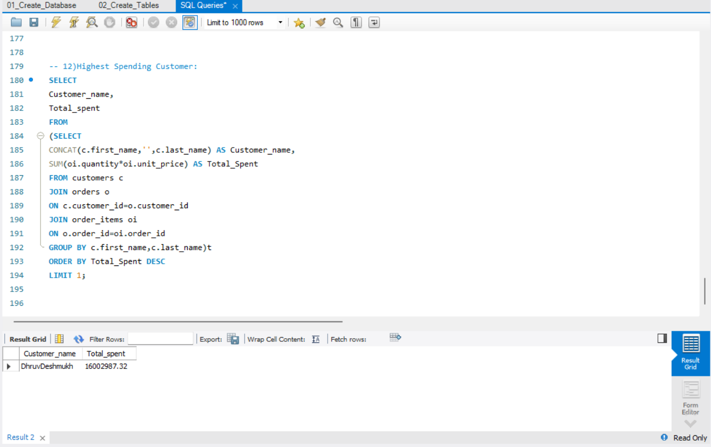
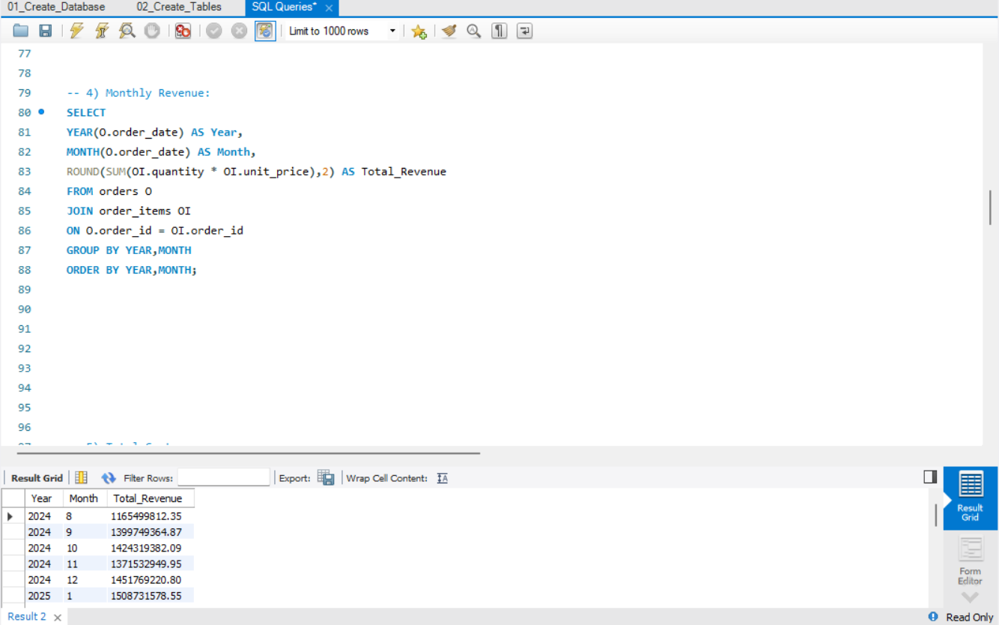
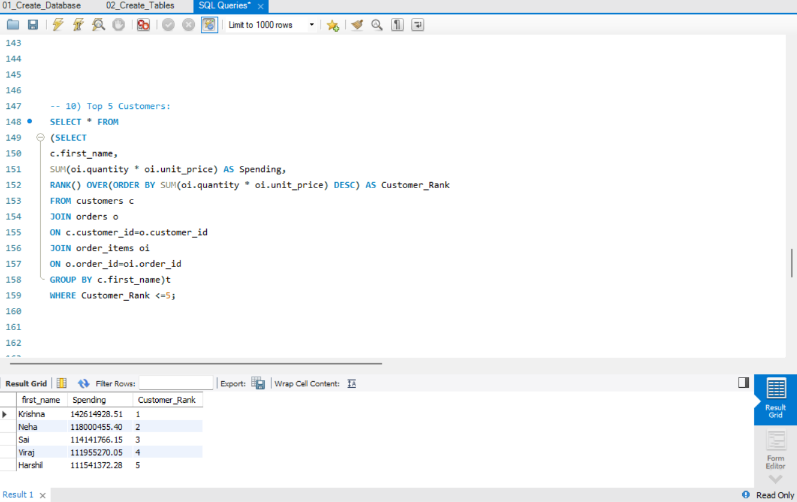
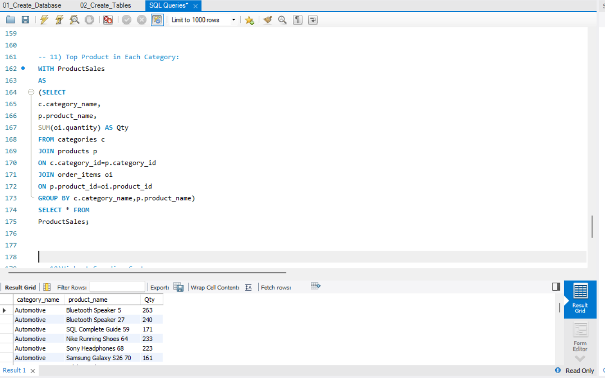
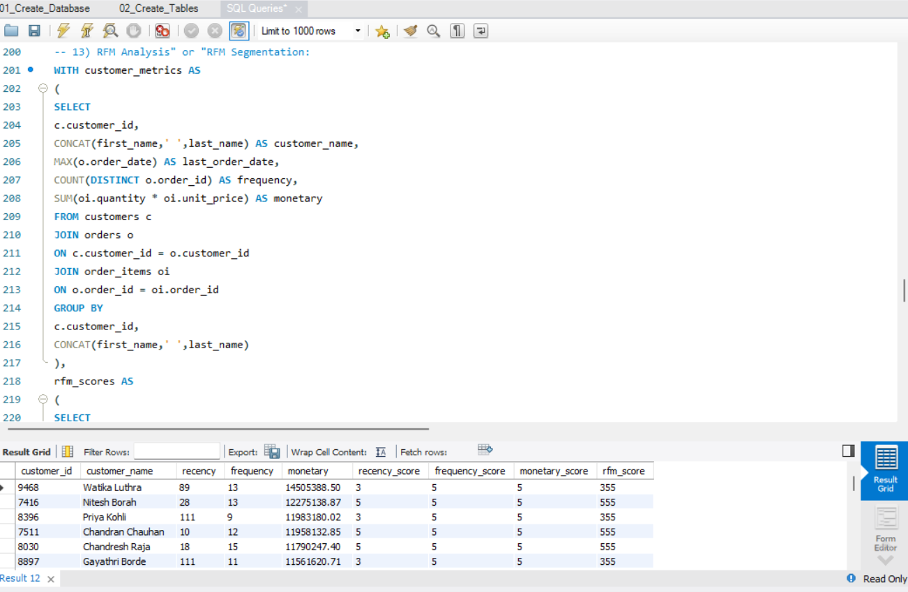
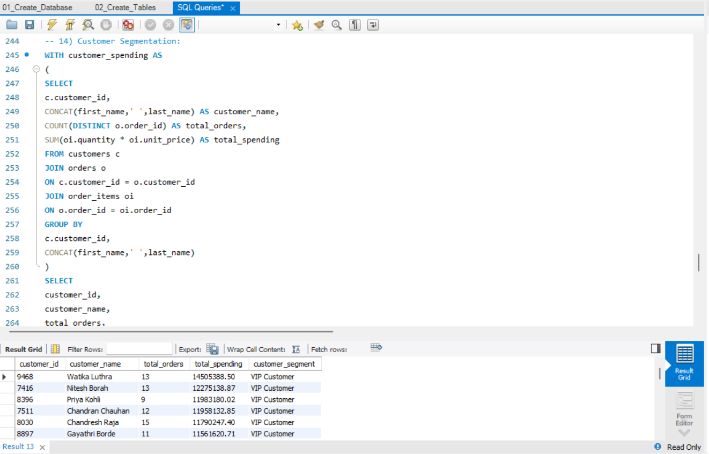

# 🛒 Ecommerce Sales Analytics using SQL

## 📌 Project Overview
This project focuses on analyzing e-commerce sales data using SQL to extract meaningful business insights. The goal is to understand sales performance, customer behavior, product trends, regional performance, and customer value through data analysis.

---

The project demonstrates practical SQL skills including database creation, data importing, data cleaning, aggregation, joins, subqueries, CTEs, and window functions.

---

## 🎯 Problem Statement
E-commerce businesses generate large amounts of transactional data. Analyzing this data helps organizations understand:

Revenue performance
Customer purchasing patterns
Best-selling products
Category performance
Regional sales trends
Customer value, loyalty, and churn risk
This project uses SQL-based analysis to answer important business questions and support data-driven decision-making.

---

## 📂 Dataset Information

The dataset contains transactional e-commerce sales records with details about:

```
  Column	             Description

- Order ID  	   Unique identifier for each order
- Order Date 	   Date when order was placed
- Customer ID 	   Unique customer identifier
- Customer Name    Customer details
- Product Name     Name of purchased product
- Category         Product category
- Region 	       Customer region
- State	           Customer state
- Quantity  	   Number of products purchased
- Sales 	       Revenue generated
- Profit 	       Profit earned

```
---

## 🛠️ Technologies Used

- MySQL
- SQL
- MySQL Workbench
- CSV Dataset
- Git & GitHub

---

## 🗄️ Database Design

The project includes:

- Database creation
- Table creation
- Data importing
- Data validation
- Analytical queries

Example:

CREATE DATABASE ecommerce_sales;

---

## 🔍 Business Analysis Performed


1. Sales Performance Analysis
Analyzed:

- Total revenue generated
- Monthly sales trends
- Yearly sales growth
- Average order value
- Example:

```
SELECT 
SUM(sales) AS total_revenue
FROM orders;
```

---

2. Product Analysis
Identified:

- Top-selling products
- Most profitable categories
- Product contribution to revenue
- Example:

```
SELECT
product_name,
SUM(sales) AS revenue
FROM orders
GROUP BY product_name
ORDER BY revenue DESC;
```

---

3. Customer Analysis
Performed customer-level analysis:

- Top spending customers
- Customer purchase frequency
- Repeat customers
- Customer value analysis
- Example:

```
SELECT
customer_name,
SUM(sales) AS total_spending
FROM orders
GROUP BY customer_name
ORDER BY total_spending DESC;
```

---

4. Regional Sales Analysis
Analyzed:

- Sales by region
- State-wise performance
- Regional profitability
- Example:

```
SELECT
region,
SUM(sales) AS revenue
FROM orders
GROUP BY region;
```

---

5. Customer Segmentation (RFM Analysis)
Goes beyond simple top-spender ranking to classify every customer by behavior, using two complementary SQL approaches.

## Business Question:

Who are our most valuable customers, and which valuable customers are at risk of churning?

**Approach A — Threshold-Based Segmentation**
Classifies customers into VIP, High Value, Repeat, and Occasional tiers using fixed spend/order thresholds. Simple, fast, and easy for non-technical stakeholders to interpret.

```sql
WITH customer_spending AS (
    SELECT
        c.customer_id,
        CONCAT(c.first_name, ' ', c.last_name) AS customer_name,
        COUNT(DISTINCT o.order_id) AS total_orders,
        SUM(oi.quantity * oi.unit_price) AS total_spending
    FROM customers c
    JOIN orders o ON c.customer_id = o.customer_id
    JOIN order_items oi ON o.order_id = oi.order_id
    GROUP BY c.customer_id, CONCAT(c.first_name, ' ', c.last_name)
)
SELECT
    customer_id,
    customer_name,
    total_orders,
    total_spending,
    CASE
        WHEN total_spending >= 10000 AND total_orders >= 5 THEN 'VIP Customers'
        WHEN total_spending >= 5000  AND total_orders >= 3 THEN 'High Value Customers'
        WHEN total_orders >= 2 THEN 'Repeat Customer'
        ELSE 'Occasional Customer'
    END AS customer_segment
FROM customer_spending
ORDER BY total_spending DESC;
```

**Approach B — RFM Analysis (Relative Scoring)**
Scores every customer on Recency, Frequency, and Monetary value using `NTILE(5)`, ranking customers relative to each other rather than against fixed numbers. Unlike Approach A, this method captures **recency** — so it can surface high-value customers who are going quiet, a signal the threshold method misses entirely.

```sql
WITH customer_metrics AS (
    SELECT
        c.customer_id,
        CONCAT(c.first_name, ' ', c.last_name) AS customer_name,
        MAX(o.order_date) AS last_order_date,
        COUNT(DISTINCT o.order_id) AS frequency,
        SUM(oi.quantity * oi.unit_price) AS monetary
    FROM customers c
    JOIN orders o ON c.customer_id = o.customer_id
    JOIN order_items oi ON o.order_id = oi.order_id
    GROUP BY c.customer_id, CONCAT(c.first_name, ' ', c.last_name)
),
rfm_scores AS (
    SELECT *,
        DATEDIFF((SELECT MAX(order_date) FROM orders), last_order_date) AS recency,
        NTILE(5) OVER (
            ORDER BY DATEDIFF((SELECT MAX(order_date) FROM orders), last_order_date) DESC
        ) AS recency_score,
        NTILE(5) OVER (ORDER BY frequency) AS frequency_score,
        NTILE(5) OVER (ORDER BY monetary) AS monetary_score
    FROM customer_metrics
)
SELECT
    customer_id,
    customer_name,
    recency,
    frequency,
    ROUND(monetary, 2) AS monetary,
    recency_score,
    frequency_score,
    monetary_score,
    CONCAT(recency_score, frequency_score, monetary_score) AS rfm_score
FROM rfm_scores
ORDER BY monetary DESC;
```

--- 

## **Reading an RFM Score**

- Each customer gets a 3-digit code (e.g. "555" or "355") from their R/F/M scores (1–5 each):

| Segment | Typical Pattern | Meaning |
|---|---|---|
| Champions | R:4-5, F:4-5, M:4-5 | Best customers overall |
| Loyal Customers | R:3-5, F:3-5, M:3-5 | Solid regulars |
| Potential Loyalists | R:4-5, F:1-3, M:1-3 | Recent but not yet frequent |
| New Customers | R:5, F:1, M:1 | First-time buyers |
| At Risk | R:1-2, F:3-5, M:3-5 | Used to be great, gone quiet |
| Can't Lose Them | R:1-2, F:4-5, M:4-5 | Big spenders going quiet — urgent |
| Hibernating | R:1-2, F:1-2, M:1-2 | Low priority |

This information can be used for:

- Targeted win-back campaigns for "Can't Lose Them" customers
- Loyalty programs for Champions and Loyal Customers
- Personalized marketing spend allocation
- Churn-risk prioritization for the retention team

--- 

## 📊 Advanced SQL Concepts Used:

---

## The project applies:

### ✅ Aggregate Functions

- SUM()
- COUNT()
- AVG()
- MAX()
- MIN()
### ✅ Filtering & Sorting

- WHERE
- HAVING
- ORDER BY

### ✅ Joins

- INNER JOIN
- LEFT JOIN

### ✅ Subqueries

### ✅ Common Table Expressions (CTEs)

### ✅ Window Functions

- RANK()
- ROW_NUMBER()
- DENSE_RANK()
- NTILE()

### ✅ Customer Segmentation Logic

- CASE WHEN rule-based segmentation
- NTILE-based relative RFM scoring

---

## 📊 SQL Analysis Results
Here are the screenshots of key SQL query outputs generated during the Ecommerce Sales Analytics project.

The results demonstrate practical SQL analysis across customer behavior, sales trends, product performance, and customer segmentation.

## 📁 Results:

1. Highest Purchasing Customer
This analysis identifies the customer with the highest total purchase value.

Business Question:

Which customer has contributed the most revenue to the business?

Highest Purchasing Customer

> Which customer has contributed the most revenue to the business?



---

2. Monthly Sales Analysis
This analysis shows sales performance across different months.

Business Question:

How does revenue change over time?

Monthly Sales

This analysis can help identify:

Monthly sales trends
High-performing periods
Low-performing periods
Potential seasonal patterns

> How does revenue change over time?



---

3. Top Customers
This query ranks customers based on their total spending.

Business Question:

Who are the most valuable customers?

Top Customers

This information can be used for:

Customer segmentation
Loyalty programs
Targeted marketing
Customer retention strategies

> Who are the most valuable customers?



---

4. Top Products
This analysis identifies the products generating the highest sales.

Business Question:

Which products are the best performers?

Top Products

These insights can support:

Inventory planning
Product promotion
Sales strategy
Product portfolio optimization

> Which products are the best performers?



---

5. Customer RFM Segments
This analysis classifies every customer into an RFM segment based on recency, frequency, and monetary value.

Business Question:

Which customers are Champions, and which valuable customers are at risk of churning?





RFM Segmentation

## 🎯 Business Insights
The SQL analysis provides a foundation for understanding:

- 💰 Revenue performance
- 👥 Customer purchasing behavior
- 📈 Monthly sales trends
- 🛍️ Product performance
- ⭐ High-value customers and churn risk

### These results demonstrate how SQL can be used to transform transactional ecommerce data into actionable business insights.

---

## 📈 Key Insights Generated

Some insights obtained from analysis:

- Identified products generating maximum revenue.
- Found the highest-performing categories.
- Analyzed customer spending patterns.
- Compared sales performance across regions.
- Discovered repeat customer behavior.
- Evaluated profitability trends.
- Segmented customers into actionable RFM personas (Champions, At Risk, Hibernating, etc.) using relative ranking instead of fixed thresholds.

---

## 📁 Project Structure

```
Ecommerce-Sales-Analytics-SQL
│
├── Dataset
│   └── ecommerce_sales.csv
│
├── SQL Queries
│   ├── database_creation.sql
│   ├── data_import.sql
│   ├── data_cleaning.sql
│   ├── sales_analysis.sql
│   └── customer_rfm_segmentation.sql
│
├── Results
│   └── query_outputs.png
│
├── docs
│   └── RFM_Customer_Segmentation_Project.pdf
│
└── README.md
```

--- 

## 🚀 Future Improvements

- Build an interactive Power BI dashboard
- Use RFM scores as input features for a K-Means clustering model
- Build a churn-prediction classifier on top of RFM features
- Automate reporting using Python
- Deploy analytics pipeline using cloud services

---

👨‍💻 Author

Anuj Bhatt

---

## Skills:

- SQL
- Python
- Machine Learning
- Data Analytics
- Power BI

---

⭐ If you found this project useful, consider giving it a star!
